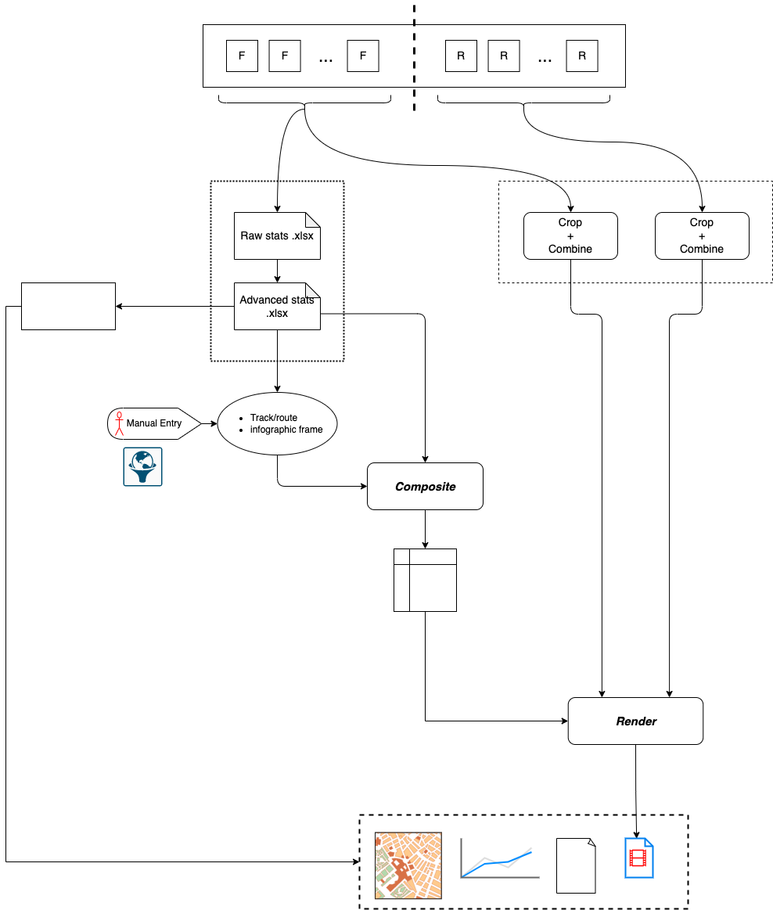

# MoviePy_Test

## About
Video compositing and rendering using Python. Supplement to my dash cam visualization project.

### Work Flow
The following pipelined flowchart depicts how input is processed. Pipeline stages are represented by the variable T. Tasks in the same stage can be performed in parallel.

At T=0, I have video recordings from my dash cam's front and rear channels.

  

